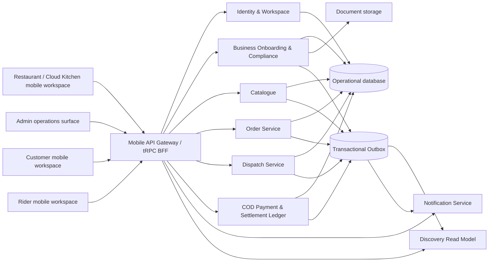
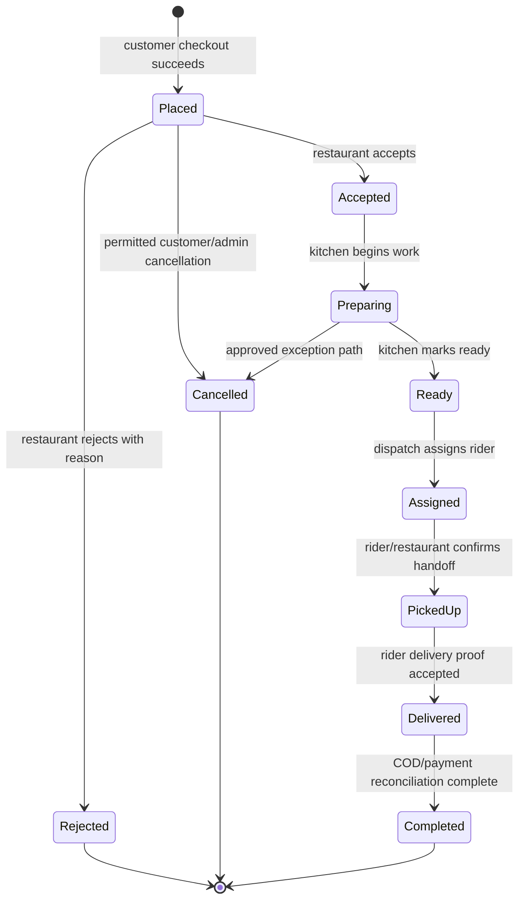
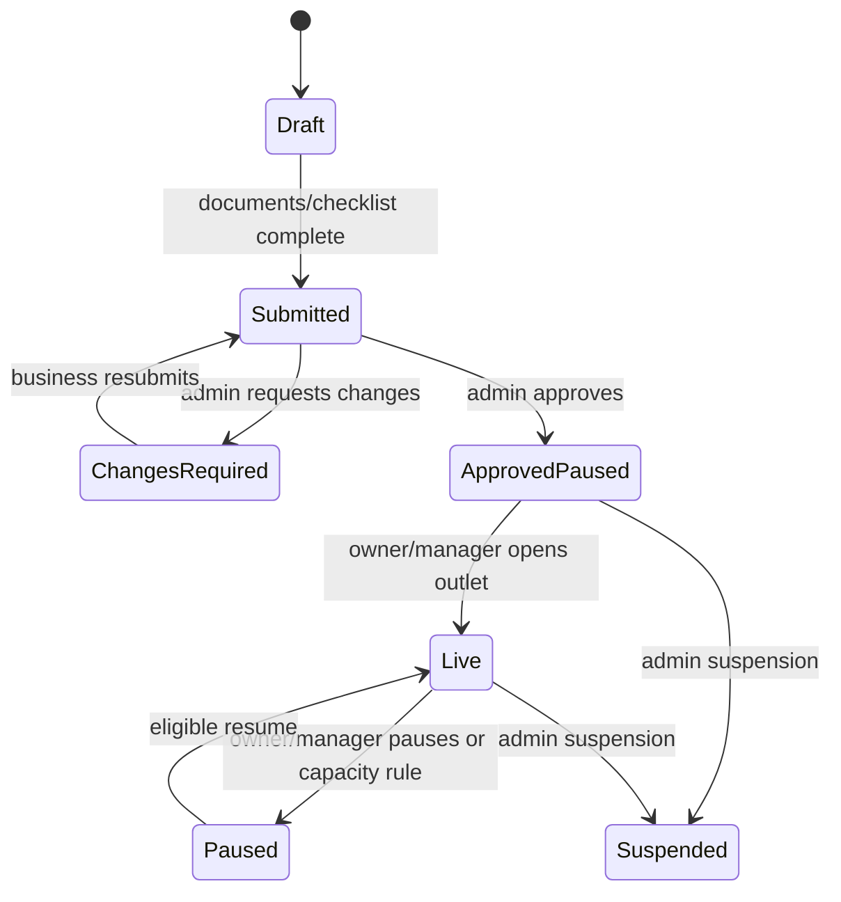

# Khana KarLo Restaurant Management System
## Detailed System Design and Operational Audit

**Document status:** Target-state system design grounded in the current implementation  
**Author:** Manus AI  
**Scope:** Restaurant and Cloud Kitchen management for the Islamabad/Rawalpindi COD-first pilot  
**Architecture posture:** One mobile app, API gateway/BFF, domain-oriented backend modules, single-database-first migration  
**Design principle:** A Restaurant must never receive, prepare, hand off, or financially reconcile an order through client-only state.

> **Executive finding.** Khana KarLo has a credible Restaurant Management foundation: approval-gated Business onboarding, live/paused publication, catalogue editing, protected gateway procedures, Admin review, typed domain modules, and a transactional outbox. However, the active Restaurant order queue is still backed by a local Merchant store. It therefore demonstrates workflow but is not yet an auditable Restaurant operating system. The immediate production priority is a persisted Order Service that turns the existing queue into the Restaurant command center. [1] [2] [3]

---

## 1. Audit Scope and Current Maturity

This audit covers the full Restaurant operating chain: Business activation, outlet controls, menu and availability management, orders, kitchen preparation, Rider handoff, COD visibility, staff authorization, exceptions, metrics, audit evidence, and Cloud Kitchen extensions. It treats the current mobile screen behavior as evidence, not as proof of commercial readiness.

| Capability | Current status | Audit conclusion | Pilot requirement |
|---|---|---|---|
| Restaurant/Cloud Kitchen application | **Implemented foundation** | Resumable application, documents, checklist, review and approval exist | Formal reviewer SOP and real identity verification |
| Admin approval | **Implemented foundation** | Approval activates Business workspace and emits `business.approved` outbox event | Internal admin roles, suspension policy and decision evidence |
| Outlet live/paused control | **Implemented foundation** | Business dashboard can control customer discovery state | Operating hours, capacity and exception-aware auto-pause |
| Catalogue CRUD | **Implemented foundation** | Categories, items, modifiers, prices, prep time, availability, live controls | Price snapshot at order time, stock policy, images and publication controls |
| Restaurant dashboard | **Partially implemented** | Dashboard links to management tools; “Incoming” metric is currently `0` | Persisted queue metrics, SLA risk, capacity and settlement data |
| Live order queue | **Preview only** | `new → preparing → ready → outForDelivery` runs in local Merchant state | Persisted Order Service and server-authoritative commands |
| Rider handoff | **Preview only** | UI workflow exists but no real Dispatch assignment | Manual Dispatch domain, proof and delivery status integration |
| COD / commissions | **Not implemented** | UI can display cash context only | Ledger, collection record, settlement and audit controls |
| Notifications | **Foundation only** | Outbox infrastructure exists; in-app success feedback exists | Event consumer, device registration, push/in-app notification delivery |
| Staff permissions | **Schema foundation** | Staff membership data model exists | Role matrix, invitation, revocation and command authorization |
| Cloud Kitchen operations | **Data foundation** | Kitchen, brand and station models exist | Production board, capacity, routing and multi-brand financial reporting |

The highest-risk mismatch is clear: **the Restaurant UI currently looks like an operating system, but orders are not yet shared, persisted marketplace records**. The design below makes this gap explicit and prevents it from being hidden by additional screens. [1] [2]

---

## 2. Operating Context and Design Principles

The pilot begins with one or two approved Restaurants or Cloud Kitchens, a controlled Rider pool, manual dispatch, COD collection, and active Khana KarLo operations support. The Restaurant Management System must optimise for correctness, recoverability, and clear operator responsibility before automation.

| Principle | Design rule |
|---|---|
| **One source of truth** | A Restaurant sees only Order Service records; local mobile state may cache or optimistically render, but cannot be authoritative. |
| **Minor units only** | Prices, fees, discounts, commissions and COD use integer paisas across client, gateway, database and events. |
| **Server-authoritative commands** | The mobile app requests a transition; the backend verifies actor role, outlet ownership, current state, invariants and idempotency. |
| **Outbox on every transition** | Every Business, Order, Dispatch and Payment state change writes its own data and an event atomically. |
| **Human override is explicit** | Manual acceptance, rejection, Rider assignment, pause and exception resolution must identify the actor, reason and timestamp. |
| **Pilot complexity is controlled** | Manual dispatch and manual settlement precede GPS routing, auto-assignment, cards and wallet payouts. |
| **Multi-tenant isolation** | Every Business query includes organisation/outlet ownership; a manager of one outlet cannot view or mutate another. |
| **Graceful connectivity handling** | Availability mutations may retry; order commands require idempotency keys and final server reconciliation. |

---

## 3. Target Architecture

The Restaurant Management app remains part of the single Khana KarLo mobile app. It communicates only with the tRPC API gateway. The gateway routes calls to domain services; initial services run in the current backend process behind strict module boundaries. This is a **modular service decomposition**, not yet separately deployed network microservices. [2]

### 3.1 Service Ownership

| Domain | Owns | Must not own | Restaurant-facing result |
|---|---|---|---|
| Identity & Workspace | Account, membership, Business/Rider approval, staff role binding | Orders, menu, payments | Correct tenant and staff authorization |
| Business Onboarding | Application, legal/operating documents, checklist, approval and suspension | Menu edits, order state, COD balance | Only authorised Businesses can operate |
| Catalogue | Categories, menu items, modifiers, availability, outlet publication state | Order price snapshots, Dispatch, ledger | Restaurant controls what can be discovered and ordered |
| Order | Order aggregate, lines, price snapshot, Restaurant decision, prep state, cancellation | Rider location, cash balances | Real queue, kitchen work and order history |
| Dispatch | Delivery job, Rider selection, pickup/delivery proof | Order price changes, financial accounting | Ready orders become assigned delivery work |
| Payments/COD | Expected cash, collected cash, commissions, settlement ledger | Delivery state mutation | Restaurant sees earned, pending and settled balances |
| Notifications | Device token, preference, in-app log, delivery attempts | Canonical order state | Restaurant receives reliable new-order/exception alerts |
| Discovery | Customer-ready projection | Catalogue writes or order commands | Fast read model for customer discovery |

---

## 4. Restaurant Operating Model

### 4.1 Daily Lifecycle

The operating day is a controlled lifecycle, not simply a live/paused switch.

| Stage | Responsible actor | Required system behavior | Evidence retained |
|---|---|---|---|
| Pre-open check | Owner or Manager | Confirm approval active, outlet hours, capacity, staff, menu availability, and any hold state | `outlet.opened` audit event |
| Open for discovery | Owner or Manager | Set outlet to live if eligibility passes; publish current menu projection | Live state, actor, reason, time |
| New order | Order Service | Validate catalogue, compute price snapshot, create order, emit `order.placed` | Order, lines, tax/fee snapshot, idempotency key |
| Accept or reject | Manager/Kitchen Operator | Accept only when outlet live and capacity permits; reject with reason if not | Actor, reason, preparation target |
| Prepare | Kitchen Operator | Work queue tracks prep start, target ready time, delay state and item exceptions | Status timestamps and delay reason |
| Ready for dispatch | Kitchen Operator/Manager | Mark ready only after all required items complete; emit event | `order.ready_for_dispatch` |
| Assign and hand off | Admin/Restaurant Manager initially | Dispatch assigns Rider; Restaurant confirms pickup handoff | Rider ID, handoff time, proof/exception record |
| Delivered and COD | Rider then Payment service | Dispatch confirms delivery; COD expected/collected is reconciled separately | Delivery proof, cash collection, commission entry |
| Close | Owner or Manager | Pause discovery, prevent new acceptance, display remaining work and day summary | `outlet.closed` audit event |

### 4.2 Open, Paused, and Safety State

The current `live` and `paused` status is retained but expanded into a controlled outlet-operating state.

| State | Customer visibility | New orders | Existing orders | Allowed actor | Required reason |
|---|---|---|---|---|---|
| `draft` | Hidden | Blocked | None | System / Owner | Application incomplete |
| `approved_paused` | Hidden | Blocked | Continue if any legacy work exists | Owner/Manager | Manual pause, capacity, holiday or emergency |
| `live` | Discoverable | Accepted if capacity permits | Active | Owner/Manager | Opening checklist complete |
| `soft_paused` | Hidden from new discovery | Blocked | Must complete active queue | Owner/Manager/System | Capacity, stock, temporary incident |
| `suspended` | Hidden | Blocked | Admin exception process only | Admin | Compliance, quality or fraud action |
| `closed_for_day` | Hidden | Blocked | Must complete or hand over active orders | Owner/Manager | End-of-day close |

The system must reject an order-accept command if the outlet is not `live`, the Business is suspended, or the actor lacks outlet permission. The app may offer a toggle, but the server resolves whether the requested state is legal.

---

## 5. Functional Modules and Screen Design

### 5.1 Restaurant Command Center

The existing Business dashboard becomes a real command center once Order and Dispatch data exists.

| Dashboard block | Data source | Required content | Action |
|---|---|---|---|
| Operating state | Business/Catalogue | Live/paused, current hours, next scheduled opening, capacity mode | Open, pause, resume, edit operating exception |
| Queue health | Order read model | New, accepted, preparing, ready, overdue, unassigned counts | Open filtered queue |
| SLA risk | Order Service | Orders within breach threshold, oldest queue age, average prep delay | Open risk list, bulk pause if necessary |
| Catalogue health | Catalogue | Available items, out-of-stock items, unpublished changes | Open availability manager |
| Dispatch health | Dispatch | Ready-unassigned count, oldest waiting time, pickup delays | Open manual assignment / escalation |
| COD position | Payment ledger | Today’s expected COD, collected, pending reconciliation, commission estimate | Open settlement statement |
| Quality alerts | Order/Support | Cancellations, rejections, substitutions, complaints | Open exception queue |

**Current audit finding:** The dashboard currently provides useful navigation, Business live controls and catalogue counts, but the incoming-order metric is hard-coded to `0`. It must not be interpreted as a live operational KPI until the Order read model exists. [1]

### 5.2 Order Command Center

The current Live Orders screen should become the primary Restaurant operational surface. It should read only from `order.listForBusiness` and issue idempotent command mutations.

| View | Filter | Card data | Permitted actions |
|---|---|---|---|
| New | `PLACED` | Order number, elapsed time, customer initials, items, total, COD/online tag, promised prep time | Accept, reject, view detail |
| Preparing | `ACCEPTED`, `PREPARING` | Kitchen stage, item count, target ready time, delay risk | Start preparation, update prep estimate, request help |
| Ready | `READY`, `ASSIGNED` | Ready age, Rider assignment state, pickup ETA | Mark ready, request manual dispatch, confirm pickup handoff |
| Completed history | Delivered/completed/cancelled/rejected | Financial summary, reason, timestamps, actor history | View receipt, report issue, export statement |
| Exceptions | SLA breach, cancellation, substitution, payment mismatch | Severity, owner, required action | Resolve/escalate with reason |

Order detail must include immutable pricing, every line and modifier snapshot, delivery/customer instruction, food-allergen/internal notes policy, current state, timeline, SLA target, Rider assignment, COD expectation, and an auditable actor timeline. Customer phone number should be masked by default and revealed only when a permitted workflow requires contact.

### 5.3 Catalogue and Availability

The existing Business catalogue is retained and expanded with controlled publication.

| Object | Existing capability | Required operating controls |
|---|---|---|
| Category | Create/edit and order context | Archive, scheduling, outlet/brand scope, visibility policy |
| Menu item | Name, price, prep time, availability | Tax/fee handling, image, dietary tags, stock rule, preparation station, sales state |
| Modifier | Existing add/edit foundation | Required/optional limits, default, modifier price snapshot, stock dependency |
| Availability | Toggle with optimistic retry queue | Item-level, modifier-level, scheduled, capacity-driven and emergency pause reason |
| Publication | Business live state | Draft/published version, review before publish, last editor and effective time |

For pilot launch, a manual availability toggle is sufficient. The order creation endpoint must copy item name, modifier selection, unit price and tax/fee calculation into an immutable `order_lines` snapshot; an item price changed after checkout must not mutate the value on an already placed order.

### 5.4 Outlet, Staff, and Cloud Kitchen Controls

| Module | Pilot design | Post-pilot extension |
|---|---|---|
| Outlet profile | Name, address, contact, hours, service zone, live state | Multiple outlets, regional policies, holiday calendar |
| Staff | Owner, Manager, Kitchen Operator, Viewer | Custom permissions, shift roster, terminal session control |
| Preparation capacity | Manual capacity mode: normal, limited, paused | Station capacity, dynamic throttling, prep forecast |
| Cloud Kitchen | Single kitchen with multiple brands defined in schema | Brand-specific queue, production station routing, shared ingredient policy |
| Reports | Daily order/COD/rejection overview | Schedule reports, item performance, workforce analytics |

---

## 6. Role and Permission Matrix

All protected commands are evaluated server-side using the current actor’s workspace membership, organisation, outlet, staff role, and record state.

| Command | Owner | Manager | Kitchen Operator | Viewer | Admin |
|---|---:|---:|---:|---:|---:|
| Edit Business legal/financial profile | Yes | No | No | No | Review only |
| Set outlet live/paused | Yes | Yes | No | No | Suspend/override |
| Edit catalogue and availability | Yes | Yes | Limited availability only | No | Support override with audit |
| Accept/reject order | Yes | Yes | Configurable | No | Emergency support only |
| Set preparation/ready state | Yes | Yes | Yes | No | Support override with audit |
| Assign Rider manually | Yes | Yes | No | No | Yes |
| Confirm pickup handoff | Yes | Yes | Yes | No | Support override |
| View financial statement | Yes | Configurable | No | No | Yes |
| Invite/revoke staff | Yes | No | No | No | Support policy |
| Suspend Business | No | No | No | No | Yes |

Every financial, state-changing, privacy-sensitive, or override command appends an audit event with actor, role, request/correlation ID, old state, new state, reason, and timestamp.

---

## 7. Authoritative State Machines

### 7.1 Order Lifecycle

| Transition | Command actor | Mandatory guards | Outbox event |
|---|---|---|---|
| `Placed → Accepted` | Owner/Manager/Kitchen Operator with permission | Outlet live, order belongs to outlet, order still placed, capacity allows | `order.accepted` |
| `Placed → Rejected` | Permitted Restaurant actor | Valid rejection code, order still placed | `order.rejected` |
| `Accepted → Preparing` | Manager/Kitchen Operator | Order belongs to outlet; current status accepted | `order.preparation_started` |
| `Preparing → Ready` | Manager/Kitchen Operator | All mandatory item work complete; no unresolved substitution | `order.ready_for_dispatch` |
| `Ready → Assigned` | Dispatch/Admin/authorised Manager during pilot | Rider available and approved; job not already assigned | `dispatch.rider_assigned` |
| `Assigned → PickedUp` | Rider plus Restaurant handoff confirmation | Matching active Rider assignment; pickup evidence | `dispatch.order_picked_up` |
| `PickedUp → Delivered` | Assigned Rider | Delivery proof policy passed | `dispatch.order_delivered` |
| `Delivered → Completed` | Payment reconciler/system | COD expected/collection conditions satisfied | `payment.cod_reconciled`, `order.completed` |

No mobile screen may directly mutate state. Each command carries an idempotency key. Retrying the same request returns the original outcome, not a duplicate state transition.

### 7.2 Business Approval and Publication

Approval must atomically activate the Business workspace membership and record `business.approved` in the transactional outbox. Current implementation has this first event foundation; future consumers will initialize discovery projections and notify the applicant. [2]

---

## 8. Data Design

### 8.1 Existing Data Foundation

Current schema ownership already includes Business organisations, outlets, Cloud Kitchens, brands, stations, hours, service zones, categories, items, modifiers, documents, staff memberships, payout profiles, checklists, workspace memberships, applications, audit events and transactional outbox events. The missing operational data must be added additively through reviewed Drizzle migrations. [2]

### 8.2 Required New Records

| Table or aggregate | Key fields | Owner | Notes |
|---|---|---|---|
| `orders` | `id`, `customer_id`, `business_id`, `outlet_id`, `status`, `currency`, minor-unit totals, address snapshot, timing fields, idempotency key | Order | One canonical aggregate; do not store mutable menu references as pricing truth |
| `order_lines` | `order_id`, item/modifier snapshot, quantity, unit price, total, notes | Order | Immutable after placement except explicit substitution record |
| `order_status_history` | order, from/to state, actor, reason, command key, occurred time | Order | Supports audit, support and SLA analysis |
| `order_exceptions` | order, type, severity, owner, notes, resolution | Order/Support | Delays, substitutions, cancellation, missing item, fraud or COD mismatch |
| `delivery_jobs` | order, rider, status, assignment time, pickup/delivery times | Dispatch | Created only when order ready for dispatch |
| `delivery_proofs` | job, proof method, consent-safe metadata, recorded time | Dispatch | PIN/photo/OTP policy selected before pilot |
| `rider_profiles` | account, approval state, availability, vehicle, operational status | Dispatch/Identity boundary | Rider membership remains Identity; delivery operations are Dispatch |
| `payments` | order, method=COD, expected amount, collected amount, status | Payments | Financial facts, not UI-only status |
| `ledger_entries` | account type, account ID, debit/credit minor units, source event, immutable time | Payments | Restaurant/rider commission and settlement trail |
| `notification_records` | actor/account, event, channel, state, delivery attempt | Notifications | In-app history and push audit |
| `processed_events` | consumer, event dedupe key, processed time | Each consumer | Required for idempotent outbox consumption |

### 8.3 Query and Index Design

| Hot query | Required index | Reason |
|---|---|---|
| Restaurant active queue | `(outlet_id, status, placed_at)` | Fast queue and oldest-order SLA reads |
| Customer order history | `(customer_id, created_at DESC)` | Efficient order history |
| Ready unassigned dispatch work | `(status, ready_at)` | Manual assignment and breach alerts |
| Rider active work | `(rider_id, status)` | Mobile Rider dashboard |
| COD outstanding | `(business_id, settlement_status, completed_at)` | Restaurant statement/reconciliation |
| Outbox worker poll | `(processed_at, next_attempt_at, occurred_at)` | Efficient retry and event publication |

---

## 9. Gateway API and Event Contracts

The Expo client keeps tRPC. The gateway adapts calls to services and exposes stable response shapes. The following names are proposed for the first Restaurant Management production slice.

| Procedure | Actor | Purpose |
|---|---|---|
| `restaurantDashboard.get` | Owner/Manager/Kitchen Operator | Queue, SLA, operating, catalogue and COD summary |
| `order.listForBusiness` | Business staff | Paginated/filterable Restaurant queue |
| `order.getById` | Customer/Business/Admin according to ownership | Full timeline and immutable snapshot |
| `order.accept` | Permitted Business staff | Accept placed order with prep target and idempotency key |
| `order.reject` | Permitted Business staff | Reject with controlled reason code |
| `order.startPreparation` | Permitted Business staff | Begin prep and update target time |
| `order.markReady` | Permitted Business staff | Move to dispatch-ready after guards |
| `order.reportException` | Permitted Business staff | Create support/quality exception |
| `dispatch.assignRider` | Manager/Admin during pilot | Manual Rider assignment |
| `dispatch.confirmPickupHandoff` | Restaurant/Rider with assignment | Record pickup handoff |
| `payment.getBusinessStatement` | Owner/authorised Manager | COD/commission/settlement read model |
| `catalogue.setAvailability` | Owner/Manager/Kitchen Operator scope | Existing compatibility mutation with server authorization |
| `outlet.setOperatingState` | Owner/Manager | Live, paused, capacity or close state with reason |

### 9.1 Domain Events

| Event | Producer | Consumers | Required consequence |
|---|---|---|---|
| `business.approved` | Business Onboarding | Discovery, Notifications | Create/refresh read visibility and applicant notification |
| `catalogue.item_availability_changed` | Catalogue | Discovery, Order validation | Update discoverability; validate new checkout requests |
| `order.placed` | Order | Notifications, Restaurant dashboard projection | Restaurant sees new order and receives alert |
| `order.accepted` | Order | Customer Notifications | Customer sees accepted state |
| `order.ready_for_dispatch` | Order | Dispatch, Notifications | Create assignment work and flag Restaurant waiting time |
| `dispatch.rider_assigned` | Dispatch | Customer, Restaurant, Rider Notifications | All parties see assignment state |
| `dispatch.order_picked_up` | Dispatch | Order read model, Notifications, Payments | Delivery and COD expectation becomes active |
| `dispatch.order_delivered` | Dispatch | Payments, Notifications | Trigger COD collection/reconciliation workflow |
| `payment.cod_reconciled` | Payments | Order, Restaurant/Rider statements | Permit final order completion and finance reporting |

Events are persisted in the transactional outbox in the same transaction as the state change. Every consumer writes a processed-event key before applying side effects, so retry does not duplicate a Rider assignment, notification, or ledger entry.

---

## 10. COD and Settlement Design

The pilot is COD-first. This does not mean informal cash handling. A Restaurant Management System needs exact expected amounts, immutable financial records and distinct delivery versus reconciliation state.

| Financial state | Owner | Meaning | Restaurant view |
|---|---|---|---|
| `expected` | Payments | Order was placed with COD amount | Expected cash in order detail |
| `in_delivery` | Dispatch/Payments | Assigned Rider has responsibility for delivery/cash expectation | Rider assigned; COD at risk |
| `collected` | Payments | Rider recorded collection at delivery | Gross collected pending reconciliation |
| `reconciled` | Payments/Admin | Operations accepted collection evidence | Available for settlement calculation |
| `settlement_pending` | Payments | Restaurant/Rider net balance calculated | Statement payable/receivable balance |
| `settled` | Payments/Admin | Manual bank/cash settlement recorded | Closed ledger position |

For the approved pilot model, commission is automatically calculated at completion using the agreed policy: **12% Restaurant commission and 2% Rider commission**. The ledger stores calculation inputs and resulting integer minor-unit entries; it never stores a manually typed commission as the canonical result. Automated JazzCash/EasyPaisa payout and online card collection remain deferred until the COD ledger is proven. [4]

---

## 11. Exceptions, Support and Safety

| Exception | Detection | Restaurant action | Required backend behavior |
|---|---|---|---|
| Cannot fulfil item | Kitchen notices stock/quality issue | Propose substitution or request controlled cancellation | Preserve order snapshot; record exception and customer communication trail |
| Capacity overload | Queue/SLA risk threshold | Soft-pause outlet or extend prep time | Block new acceptance as configured; retain active orders |
| Rider missing | Ready order exceeds assignment threshold | Escalate to manual dispatch | Dispatch alert, audit, reassignment trail |
| Customer cancellation | Customer/support request | Restaurant views decision state | State-specific cancellation policy, reason and financial result |
| COD mismatch | Rider or Restaurant reports amount discrepancy | Do not alter order total locally | Payment exception, evidence, restricted reconciliation path |
| Food safety complaint | Customer/support escalation | Restaurant response and evidence | High-severity case, potential outlet pause, restricted audit access |
| Outlet outage | Kitchen cannot operate | Pause with reason | Customer visibility change and active-order exception workflow |

The Restaurant must not see or edit raw customer identity more than necessary. Contact data is masked by default and revealed only under an authorised support/delivery action. Staff actions need an audit trail because order and cash errors create operational and consumer risk.

---

## 12. Metrics, Alerts and Audit Evidence

### 12.1 Restaurant Metrics

| Metric | Definition | Alert threshold for pilot | Owner |
|---|---|---|---|
| New-order age | Time since `order.placed` without decision | Configurable, initially 2 minutes | Manager |
| Acceptance rate | Accepted ÷ placed | Trend only initially; investigate sudden drops | Owner/Operations |
| Preparation SLA breach | Orders past target ready time | Immediate visible risk state | Kitchen/Manager |
| Ready-unassigned age | Time in `READY` without Rider | Configurable, initially 5 minutes | Manager/Admin dispatch |
| Rejection/cancellation rate | Rejected/cancelled ÷ placed | Daily review threshold | Owner/Operations |
| Item unavailable rate | Availability pauses per item/day | Catalogue health review | Manager |
| COD outstanding | Expected/collected/reconciled difference | End-of-shift reconciliation | Owner/Finance |
| Settlement ageing | Time from reconciled to settled | Operations finance review | Admin/Owner |

### 12.2 Audit Log Requirements

The audit trail must record approval decisions, outlet live/paused changes, catalogue edits, item availability edits, staff actions, order commands, rejection reasons, prep-time changes, Rider assignment/handoff, COD collection/reconciliation, financial adjustments and Admin overrides. Each record needs actor identity, role, Business/outlet scope, request/correlation ID, before/after where applicable, timestamp and reason.

---

## 13. Pilot Delivery Roadmap

### Phase 1 — Persisted Order-Backed Restaurant Command Center

Implement `orders`, `order_lines`, order snapshots, status history and idempotency. Replace the local Merchant queue with `order.listForBusiness`; wire the existing accept/prepare/ready UI to server commands. Emit an outbox event on every transition.

**Exit gate:** A Customer can place a real order; the correct approved Restaurant sees it; a permitted staff member accepts, prepares and marks it ready; every transition persists and emits an event.

### Phase 2 — Manual Dispatch and Restaurant Handoff

Implement Rider availability, manual assignment, delivery jobs, Rider pickup/delivery commands and Restaurant handoff confirmation. Do not add nearest-Rider matching or GPS tracking in this phase.

**Exit gate:** A ready order can be assigned, picked up, delivered and observed by Customer, Restaurant and Rider through shared backend state.

### Phase 3 — COD Ledger and Restaurant Statement

Implement expected cash, collection, reconciliation, commission calculation, Restaurant and Rider ledger entries, and settlement status. Add the Restaurant statement screen and end-of-shift reconciliation controls.

**Exit gate:** Every delivered COD order yields correct integer commission entries and visible Restaurant/Rider balance state.

### Phase 4 — Notifications and Controlled Pilot

Implement event consumers, in-app history, device registration and push notifications for new order, acceptance, Rider assignment and delivery. Pilot with one or two Restaurants and a controlled Rider group; daily-review real rejections, delays, cash mismatches and support issues.

**Exit gate:** Every material transition produces a role-appropriate alert and the operations team can resolve a failure without engineering intervention.

### Post-Pilot — Cloud Kitchen and Scale

Only after the order loop proves stable should Khana KarLo add station routing, dynamic capacity, multi-brand production board, automatic Dispatch, GPS tracking, discovery projections and independently deployed workers/services.

---

## 14. Test and Acceptance Matrix

| Layer | Required tests |
|---|---|
| Unit | Money math, order-state guards, roles, availability, commissions, retry backoff, exception policy |
| Contract | Existing mobile tRPC response compatibility for Business dashboard, catalogue, order queue and delivery actions |
| Database | Order transaction plus outbox atomicity, unique idempotency key, immutable snapshot, staff/outlet isolation |
| Integration | Customer checkout → Restaurant acceptance → Dispatch → Rider delivery → COD ledger → notification history |
| Migration | Empty DB, existing Business records, duplicate command retry, duplicate event consumption, controlled rollback |
| Security | Cross-outlet access denial, suspended Business denial, unauthorised staff denial, audit completeness |
| Pilot operations | One end-to-end real order, delayed order, rejected order, unavailable item, unassigned Rider, COD mismatch |

---

## 15. Decisions Required Before Implementation

| Decision | Recommended pilot answer | Why it matters |
|---|---|---|
| Restaurant staff roles | Owner, Manager, Kitchen Operator, Viewer | Needed before authorising order and financial commands |
| Order rejection reason codes | Closed list with customer-safe text | Required for audit and customer experience |
| Preparation SLA | Restaurant-configured target with system risk thresholds | Defines dashboard alerts and support escalation |
| Pickup handoff proof | Restaurant confirmation plus Rider confirmation; add PIN/photo only if pilot requires | Balances integrity and operational speed |
| COD reconciliation cadence | End-of-shift per Restaurant/Rider | Determines ledger and operations process |
| Customer substitution policy | Restaurant requests approval; no silent price increase | Protects pricing trust and order snapshot integrity |
| Push provider | Select after Order/Dispatch events exist | Avoids integrating notifications before there are real events |

---

## 16. Final Audit Conclusion

Khana KarLo should not expand the visual Restaurant Management app first. The next correct move is to make the **existing Restaurant queue real** through the Order Service. Once Restaurant order actions are server-authoritative and auditable, manual Dispatch, COD settlement and notifications can be added without reworking the mobile experience.

The architecture already contains the right early foundations: Business approval, catalogue ownership, a gateway-compatible domain boundary, typed error mapping, audit records and a transactional outbox. The design above turns those foundations into a Restaurant operating system that can be piloted safely, measured honestly and expanded into Cloud Kitchen management after the core order loop has proven itself. [1] [2] [3] [4]

## References

[1]: [Current Business dashboard implementation](./app/business/home.tsx)  
[2]: [Khana KarLo Service Decomposition and Microservices Migration Plan](./microservices_migration_plan.md)  
[3]: [Current Restaurant Live Orders implementation](./app/merchant/orders.tsx)  
[4]: [Approved Order → Dispatch → COD → Notifications implementation sequence](../upload/pasted_content.txt)  
[5]: [Complete Khana KarLo Application Documentation](./KHANA_KARLO_APPLICATION_DOCUMENTATION.md)
