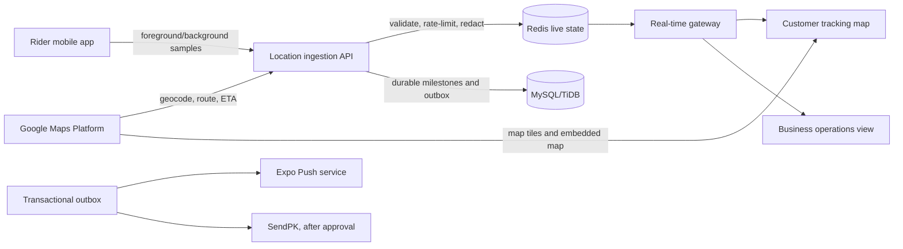

# Khana KarLo Maps, Live Tracking, Database, and Production Services Plan

## Goal

Deliver a Pakistan-first, production-oriented location and operations stack for the unified Customer, Business, and Rider mobile app. The work will replace the current foreground-only coordinate sharing, 15-second customer polling, and external Google Maps deep link with an embedded map, controlled background Rider tracking, short-latency customer updates, route/ETA calculation, and a service architecture that keeps transactional money and order data safe.

> **Recommended foundation:** retain the current MySQL-compatible TiDB schema for transactional marketplace data, add Redis for ephemeral live tracking and fan-out, and integrate Google Maps Platform for mapping, search/geocoding, routing, and ETA. This avoids a risky core-database migration while meeting the Islamabad/Rawalpindi controlled-pilot requirements.

## Current-State Assessment

| Area | Current implementation | Gap to close |
|---|---|---|
| Rider location | Foreground updates exist only during an active delivery. | Add opt-in background updates, adaptive sampling, queue/retry, and delivery-scoped session controls. |
| Customer tracking | A 15-second query and freshness gate display Rider location; the map action opens an external Google Maps URL. | Add an embedded map, real-time events, route polyline, ETA, stale/fallback states, and no-address-leakage rules. |
| Server transport | tRPC request/response APIs and transactional outbox are present. | Add a real-time gateway and Redis-backed pub/sub/presence, without using the relational database as a high-frequency location bus. |
| Database | Drizzle is configured with the MySQL dialect and the existing operational system runs on MySQL/TiDB. | Retain it for orders, payments, refunds, statements, support, audit, and durable historical location summaries. |
| Maps/provider keys | No configured production map provider or embedded map SDK. | Configure restricted Google Maps mobile keys and server-only route/geocoding credentials. |

## Target Architecture

The relational database remains the authoritative source for all money, order status, customer ownership, support, audit, and historical records. Redis is deliberately limited to non-authoritative, short-lived delivery location state, connection presence, rate-limit counters, and event fan-out. Redis loss must never change an order, payment, refund, or Rider cash balance.

## Recommended Service Stack

| Capability | Recommended service | Why it fits the pilot | Activation boundary |
|---|---|---|---|
| Core transactional database | **Existing MySQL/TiDB with Drizzle** | Preserves all working Order, COD, ledger, support, and Admin data; strongly suited to relational transactions and current code. | Continue current managed database; use additive migrations only. |
| Live location and pub/sub | **Managed Redis** | Handles frequent, expiry-based Rider position writes and low-latency fan-out without burdening MySQL/TiDB. | Select a managed Redis provider and supply a server-only connection URL. |
| Interactive map, routes, ETA, geocoding | **Google Maps Platform** | Gives one integrated provider for Pakistan pilot maps, address conversion, route polylines, distance, and ETA. [1] [2] | Create separate restricted mobile keys and a server-only key; enable only required APIs. |
| Native map canvas | **react-native-maps** | Supports Android/iOS map views; production Google Maps deployment needs mobile platform configuration. [3] | Add native map configuration and test in development builds plus physical devices. |
| Background Rider tracking | **Expo Location + Task Manager** | Fits the Expo mobile stack; requires consent, top-level task registration, native builds, and platform permissions. [4] | Do not claim background tracking is live until native Android/iOS builds, permissions, and device tests pass. |
| Customer/Rider notifications | **Expo Push + durable in-app inbox** | Existing notification records and device registration remain the durable source of truth; external push is a delivery channel. [5] | Configure Android/iOS push credentials and test on physical devices. |
| Pakistan OTP and transactional SMS | **SendPK** | Existing plan already defers this until sender/template credentials are approved; it documents API-based transactional delivery. [6] | Require approved account, sender ID, templates, rates, and retention policy. |
| Online payments | **Start COD-first; evaluate JazzCash and Easypaisa in parallel** | Both market to merchant payment acceptance and should be assessed commercially, contractually, and technically before activation. [7] [8] | No gateway charging/refunding until merchant account, webhooks, reconciliation, refund authority, and legal/tax policy are approved. |
| File storage | **Existing S3-compatible application storage** | Already supports review/menu images; continue to store keys and authorization metadata in MySQL/TiDB. | Retain current access-control and physical-deletion deferral. |
| Error monitoring | **Sentry or equivalent privacy-reviewed crash/error service** | Required before broad production rollout, with PII scrubbing and release health monitoring. | Choose provider, sign data-processing terms, configure DSN, and test redaction. |
| Product analytics | **PostHog or equivalent privacy-reviewed analytics** | Supports funnel/retention analysis without mixing behavioral analytics into financial records. | Finalize event taxonomy, consent, retention, and PII redaction before activation. |
| Internal email alerts | **Existing Resend-ready security alert path** | The code path is ready only when verified sender/recipient and key are configured. | Do not enable without verified configuration and alert policy. |

## Database Decision and Data Model

### Decision

The project should **not migrate to PostgreSQL/PostGIS now**. PostgreSQL/PostGIS is excellent for advanced nearest-neighbor and multi-city geospatial analytics, but a migration would introduce unnecessary risk across already working money, COD custody, refunds, support, Admin security, and audit workflows. TiDB’s documented MySQL compatibility does not currently provide the spatial data/index capabilities required for a PostGIS-style plan, so the pilot will instead use bounded service-zone rules plus Redis geospatial queries for operational matching. [9]

PostgreSQL/PostGIS is a future scale option only if the pilot demonstrates a need for city-wide nearest-Rider matching, sophisticated delivery polygons, dense spatial analytics, or a multi-region data platform that no longer fits the current relational-plus-Redis design. [10]

### Additive Data Records

| Record | Store | Purpose | Retention |
|---|---|---|---|
| `rider_tracking_sessions` | MySQL/TiDB | Delivery-scoped consent/session, start/stop reason, device/app metadata, precision policy. | Audit policy-defined. |
| `rider_location_events` | MySQL/TiDB | Sampled historical breadcrumbs only, with monotonic server time, accuracy, source, and redaction status. | Short pilot retention; roll up or purge by policy. |
| `rider_live:{riderId}` | Redis | Latest validated position, accuracy, heading, speed, timestamp, assigned order, and TTL. | 2–5 minute TTL; non-authoritative. |
| `delivery_live:{orderId}` | Redis | Customer-safe, delivery-scoped position snapshot and route revision. | Until delivery closes plus short grace period. |
| `location_event:{orderId}` | Redis pub/sub | Customer/Business event fan-out payload with only permitted fields. | Ephemeral. |
| `delivery_route_snapshots` | MySQL/TiDB | Route distance, duration, ETA revision, provider response metadata, cost/audit fields. | Order retention policy. |
| `service_zone_geocodes` | MySQL/TiDB | Normalized pickup/customer geocode, zone decision, and non-sensitive provider metadata. | Address retention policy. |

All point data remains integer E6 latitude/longitude or fixed precision. Every write is validated for coordinate range, accuracy, timestamp skew, active Rider/delivery ownership, and maximum update rate. Live coordinates are never written into public Business views or long-lived notification payloads.

## Implementation Phases

### Phase 1 — Provider, privacy, and release foundations

Create Google Maps projects and least-privilege API keys: separate Android, iOS, web, and server keys; package/bundle restrictions for mobile keys; IP/service restrictions for server keys; quota budgets and alerting. Establish the managed Redis environment, connection secret, TLS, backup/availability target, and outage behavior. Finalize a Rider tracking consent screen, just-in-time permission copy, location-sharing indicator, pause control, privacy notice, retention period, and support escalation policy.

Create a real native development build pipeline. Background location cannot be treated as an Expo Go feature; it requires native build configuration and physical-device validation. [4] Define Android foreground-service disclosure/notification behavior and iOS background-location purpose text before enabling the runtime capability.

### Phase 2 — Rider tracking pipeline

Add a delivery-scoped tracking session that starts only after a Rider accepts an assigned job and ends on delivery, cancellation, decline, logout, or explicit pause. Register a top-level background task, handle foreground-to-background continuity, and retain foreground updates as a fallback.

Implement adaptive sampling: higher frequency while moving on an active route, reduced frequency while stationary, and no tracking outside the accepted delivery session. Place each sample into the existing persisted Rider command queue with idempotency keys, connectivity-aware retries, bounded local storage, dead-letter visibility, and server acknowledgements.

Add a server location-ingestion procedure that confirms Rider/order ownership and lifecycle state, rejects impossible coordinates or stale/replayed payloads, rate limits writes, updates Redis atomically, samples a limited historical breadcrumb record, emits a delivery-scoped outbox event, and returns a safe sync receipt. No raw location history is exposed to Customers or Businesses.

### Phase 3 — Real-time fan-out and operational resilience

Introduce a delivery event gateway using WebSocket or Server-Sent Events, selected after validating hosting mode and connection limits. Redis pub/sub distributes state across server instances; the database remains the fallback snapshot. Customers subscribe only to their owned active order; Businesses receive order-level operational events with Rider identity/status but no unnecessary home-address exposure; Riders receive only their own job events.

Preserve current 15-second tRPC polling as a degradation path. The client will reconnect with exponential backoff, refresh the authoritative order snapshot after reconnect, display the last-update timestamp, and switch to a clear “location temporarily unavailable” state rather than inventing an ETA. Push notifications remain the wake-up/fallback channel, not the location transport.

### Phase 4 — Embedded maps, routes, ETA, and dispatch integration

Replace the external map link with a dedicated customer tracking map screen using `react-native-maps`: pickup marker, privacy-safe Rider marker, delivery destination marker, route polyline, current ETA, location freshness, and a manual refresh/error state. The map remains hidden until an order is assigned and the Rider tracking session is active.

Create server-side route/ETA adapters for geocoding and directions. Cache address/geocode and route results by order/route revision; never call route providers from the client with a secret server key. Recalculate on meaningful Rider displacement, accepted-job/start-pickup transitions, destination changes, or explicit server thresholds—not on every GPS sample.

Extend dispatch scoring to include a bounded, explainable distance/travel-time component only when a Rider has consented to live location and the data is fresh. Retain existing availability, active workload, offer expiry, COD threshold, and manual Business override guards. Store every score component and offer decision for audit.

### Phase 5 — Customer, Rider, Business, and Admin interfaces

Build the Rider tracking control on the delivery screen: permission state, session state, last successful sync, offline queue count, background-sharing status, pause/stop action, battery-safe guidance, and actionable failure recovery. Keep pickup, COD, and delivery commands usable when connectivity drops.

Build the Customer live tracking screen from the route map and real-time subscription. Add order-linked support entry when a location/ETA problem occurs. Build the Business live-order view with ETA/rider-status context and explicit “recommendation unavailable” states. Extend the web-only Admin console with tracking-session audit, delivery event timeline, support escalation context, and privacy-safe location access restricted to genuine incident handling.

### Phase 6 — Service readiness beyond maps

Complete provider boundaries already represented in the codebase. This phase prioritizes real OTP/SMS, physical-device Expo Push, payment gateway pilot, refund reconciliation, privacy-reviewed crash reporting, and privacy-reviewed analytics. Each provider gets server-side credentials, webhook verification/signature validation where available, idempotent event receipts, delivery/reconciliation dashboards, retry/dead-letter handling, alert thresholds, and a provider-off fallback.

Do not activate WhatsApp ordering, background bulk jobs, physical storage deletion, financial settlement automation, or customer email/SMS marketing in this phase unless the corresponding vendor account, terms, templates, consent policy, and operating owner are approved.

## Security, Privacy, and Cost Controls

| Control | Required behavior |
|---|---|
| Consent | Request foreground permission first; request background permission only in a clearly explained active-delivery flow. |
| Scope limitation | Track only active, accepted delivery sessions; never during general Rider availability, customer browsing, or completed orders. |
| Visibility | Customer sees only their assigned Rider during eligible active stages; Business sees operational state only; Admin access is web-only, role-scoped, and audited. |
| Precision and retention | Use full precision only for live delivery execution; retain sampled history for a short policy-approved period and then aggregate/purge. |
| API security | Require authenticated role/order ownership, idempotency, payload bounds, request-rate limits, secret storage, and audit/outbox events. |
| Provider cost | Cache geocodes/routes, set quotas and budgets, recalculate only on material movement, and prevent client-side use of server secrets. |
| Resilience | Keep SQL snapshots and polling fallback; Redis loss means temporarily unavailable live tracking, never altered financial/order data. |

## Test and Release Plan

Create deterministic tests for tracking-session ownership, lifecycle gating, coordinate validation, rate limiting, idempotent replay, Redis expiry fallback, subscriber privacy, route-cache invalidation, scoring explanation, and no map access after delivery completion. Add integration tests for Redis, Google route adapter mock responses, real-time reconnect/backoff, and provider key absence.

Validate on physical Android and iOS devices across foreground, background, lock screen, poor connectivity, offline replay, app restart, permission denial, low-accuracy GPS, stale coordinates, delivery completion, and cancellation. Perform a pilot load test that simulates the expected active Riders, sampling interval, Redis memory, real-time connection count, and route/ETA request volume. Gate rollout by an operational readiness review covering privacy copy, provider budgets, on-call incident process, location retention, and customer-support playbooks.

## Assumptions and Open Risks

This plan assumes the existing MySQL/TiDB service remains available and a managed Redis service can be provisioned. It assumes the pilot remains limited to Islamabad/Rawalpindi, COD remains the default, and no Rider compensation formula is introduced. Background location is subject to Android device-vendor behavior and iOS/Android permission decisions; therefore, customer tracking must always have truthful stale/unavailable states. The implementation will not claim live push, background tracking, routing, payment charging, or SMS delivery until credentials, native releases, legal/privacy terms, and physical-device validation are complete.

## References

[1]: https://developers.google.com/maps/documentation/geocoding/guides-v3/overview "Google Maps Platform Geocoding API overview"
[2]: https://developers.google.com/maps/ "Google Maps Platform"
[3]: https://docs.expo.dev/versions/latest/sdk/map-view/ "Expo / react-native-maps documentation"
[4]: https://docs.expo.dev/versions/latest/sdk/location/ "Expo Location documentation"
[5]: https://docs.expo.dev/push-notifications/push-notifications-setup/ "Expo Push Notifications setup"
[6]: https://sendpk.com/api.php "SendPK bulk SMS API documentation"
[7]: https://www.jazzcash.com.pk/business/accept-payments/payment-gateway "JazzCash payment gateway"
[8]: https://easypaisa.com.pk/online-payment-gateway/ "Easypaisa online payment gateway"
[9]: https://docs.pingcap.com/tidb/stable/mysql-compatibility/ "TiDB MySQL compatibility"
[10]: https://postgis.net/ "PostGIS documentation"
