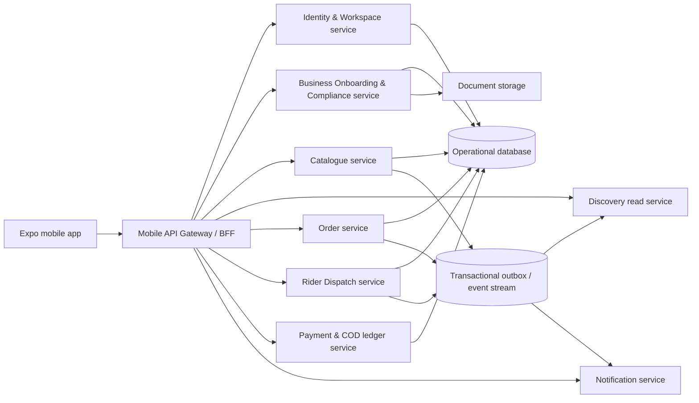

# Khana KarLo Service Decomposition and Microservices Migration Plan

## Goal

Transform the current single Express/tRPC backend into a **domain-oriented, independently deployable service architecture** without disrupting the existing Expo mobile application, Pakistan-first Customer experience, approval-gated Business workspace, or Rider workspace. The migration will reduce duplicated responsibilities and long service files, establish explicit ownership boundaries, and create a safe path from the current managed backend to separately deployed production services.

The approved planning assumption is a **phased decomposition**. Domain contracts and modules will be separated first while a stable API gateway remains in place. Each service will be deployed independently only after it has contract coverage, observability, idempotent event handling, and a proven rollback path. This avoids a high-risk “big bang” rewrite.

## Current-State Assessment

The app currently consists of one Expo client and one Node/Express/tRPC backend. The backend exposes a single `appRouter` and centralizes database access in `server/db.ts`. `server/business-service.ts` currently combines Business onboarding, document management, Admin approval, catalogue management, Business live status, and Customer discovery. The Business schema is comprehensive, but the Customer order, payment, Rider dispatch, and real-time notification domains are still local or incomplete rather than persisted production services.

| Existing concern | Current location | Migration implication |
|---|---|---|
| API entry point and request authentication | `server/routers.ts`, core tRPC files | Retain as the mobile-facing gateway during extraction. |
| Workspace and account ownership | `server/db.ts`, workspace tables | Make this the source of truth for identity and authorization. |
| Business application and approval | `server/business-service.ts` | Extract into an Onboarding/Compliance domain. |
| Restaurant and Cloud Kitchen catalogue | `server/business-service.ts` | Extract into a Catalogue domain. |
| Customer discovery | `server/business-service.ts` | Extract into a Discovery read-model domain. |
| Restaurant orders and Rider deliveries | Client-local workflow stores | Replace with persisted Order and Dispatch domains before production launch. |
| COD and other payments | Not yet a persisted domain | Design as an isolated Payment/Ledger domain; do not embed payment logic into order or rider code. |

## Target Architecture

The Expo application will communicate only with an **API Gateway/BFF** that preserves the current typed client contract during migration. The gateway will route each capability to its owner domain. Initially, service modules can execute in the current process behind the gateway; later, each domain can be moved to an independently deployed service without changing the mobile client’s public contract.

### Domain Ownership

| Service | Responsibilities | Primary data ownership | Initial mobile-facing capabilities |
|---|---|---|---|
| **Identity & Workspace** | Account profile, sessions, Customer default access, workspace membership, role approval and suspension | `account_profiles`, `workspace_memberships`, `workspace_applications`, audit identity events | `auth.*`, `workspace.*` |
| **Business Onboarding & Compliance** | Restaurant/Cloud Kitchen application, documents, checklist, Admin decision, activation request | Application details, documents, checklist, review records | `businessApplication.*`, `adminBusiness.*` |
| **Catalogue** | Categories, menu items, modifiers, availability, live/paused catalogue state | Menu and menu modifier records | `businessOperations.catalogue`, catalogue mutations |
| **Discovery** | Customer-ready live-business read model, type filtering, service-zone eligibility later | Denormalized discovery projection | `discovery.liveBusinesses` |
| **Orders** | Cart validation, prices in minor PKR units, checkout, order state machine, order history | Orders, lines, pricing snapshot, COD collection state | Customer checkout/tracking and Restaurant order queue |
| **Dispatch** | Rider availability, assignment, pickup/drop-off state, proof of delivery | Delivery job, assignment, proof metadata | Rider dashboard and delivery workflow |
| **Payments & COD Ledger** | COD receivable/collection/reconciliation, payout eligibility, future online payments | Immutable payment and settlement ledger | Cash collection and Business payout status |
| **Notifications** | In-app state updates, push-device registration, order and delivery alerts | Notification preference, device token, delivery log | Order-status alerts and push events |

## Architectural Decisions

The migration will preserve a **single database during the first extraction stage** but enforce table ownership and prohibit cross-domain write access. This lowers migration risk while removing the current code smell of unrelated logic sharing one large service. The next stage can move individual domains to their own schema or database only after their service contract and read-model needs are stable.

All cross-domain changes will use a **transactional outbox**. A domain writes its own data and an outbox record in one transaction; a worker publishes an idempotent event. Consumers store a processed-event key so retries cannot duplicate approval activation, order transitions, notifications, or COD ledger entries.

The gateway will continue to expose tRPC to Expo. Internal service contracts will be TypeScript interfaces and versioned request/event schemas. Once physically separated, the gateway may invoke services over authenticated HTTP or RPC, but the Expo client will not need a wholesale networking rewrite.

## Implementation Phases

### Phase 0 — Baseline and Anti-Corruption Boundary

First, preserve the passing application baseline and record a dependency map of routers, service methods, database tables, mobile query keys, and client-local workflow stores. Add a `server/modules` directory with explicit public interfaces. The current `appRouter` becomes a gateway composition file only; it must not gain new business logic.

The phase will also add shared error codes, a request context carrying request ID and actor ID, structured audit logging, and a service-boundary lint rule or review checklist. The goal is to stop new coupling before moving existing code.

### Phase 1 — Extract Identity and Workspace

Move account-profile, membership, application-summary, authorization, and workspace access rules out of `db.ts` into an `identity-workspace` module. Introduce explicit functions such as `getWorkspaceAccess`, `requireActiveWorkspace`, and `getCustomerSession`. Remove UI-only local fallbacks from production paths and retain them only behind a clearly named development preview adapter.

The gateway will keep the existing `auth` and `workspace` tRPC procedures. Their implementations will call the new service interface. Add contract tests for Customer default access, Business and Rider approval gates, suspension, logout, and workspace destination resolution.

### Phase 2 — Split Business Onboarding and Catalogue

Break `business-service.ts` into two modules with no mutual database writes:

1. `business-onboarding`: draft save, document upload, checklist, admin review, and approval activation request.
2. `catalogue`: scoped category, item, modifier, availability, and live-status operations.

Approval will emit `business.approved` through the outbox. Catalogue initialization and discovery projection updates consume that event. Existing mobile routes and tRPC procedure names remain compatible during this phase.

### Phase 3 — Build the Order Service Before Extending Operational Screens

Replace local Customer cart/order workflow and Restaurant demo queue with an Order service. Add persisted order, order line, price snapshot, state-transition, and idempotency-key tables. Prices must remain stored in PKR minor units. Enforce one authoritative order state machine and make every state transition append an audit event.

The Order service emits `order.placed`, `order.accepted`, `order.ready_for_dispatch`, `order.cancelled`, and `order.completed`. Restaurant queue screens read from this service rather than local state.

### Phase 4 — Build Dispatch and COD Payment Domains

Create Dispatch as a distinct service that consumes `order.ready_for_dispatch`, creates a delivery job, offers/assigns it to Riders, and records pickup, delivery, and proof-of-delivery events. Create a separate COD ledger that tracks expected cash, rider collection, reconciliation, and Business payout eligibility without allowing delivery code to modify financial balances directly.

The initial payment scope remains COD-first for Islamabad/Rawalpindi. Any future card, wallet, or gateway integration must enter through Payments rather than the Customer app or Order service directly.

### Phase 5 — Read Models, Notifications, and Independent Deployment

Move Customer discovery into a projection fed by Business, Catalogue, Order, and service-zone events. The Discovery service must serve fast read queries without scanning all menu tables at request time. Add the Notification service to consume order and dispatch events, write in-app notification records, and send push notifications after device registration is implemented.

After each domain passes contract, integration, migration, and load checks, deploy it independently behind the gateway. Keep the gateway and database migration tooling in the current managed environment initially. Introduce a continuously running worker only when outbox/event processing is enabled; it should use managed persistent hosting if the service remains within the existing resource limits. A separate infrastructure migration is not part of the first code refactor.

## Code Quality and Performance Work

The refactor will address concrete existing code smells rather than just move files:

| Problem | Required improvement |
|---|---|
| One large Business service owns unrelated workflows | Small domain modules with one public service interface per domain. |
| Routers contain schema declarations and control logic inline | Move request schemas into domain contract files and keep routers as adapters. |
| Repeated unscoped full-table reads in catalogue/discovery paths | Add repository methods with ownership filters and targeted indexes. |
| Cross-domain direct writes during approval | Use one owning transaction plus outbox events. |
| Client-local operational state | Replace with persisted Order and Dispatch services and optimistic query cache only. |
| UI role loops caused by mixed local and server guards | Identity/Workspace becomes the single access-policy owner. |
| No consistent failure taxonomy | Add typed domain errors and map them once at the gateway. |

## Data Migration and Compatibility Strategy

The migration will be additive. Existing tables remain untouched until their owning service has been exercised in production-like tests. New tables and columns will be introduced through versioned Drizzle migrations. Data transformations will be idempotent, reversible where practical, and measured with row counts before and after each migration.

The tRPC API retains existing procedure names initially. The gateway will use feature flags to choose legacy or extracted implementations per domain. A domain can be rolled back by flipping its gateway adapter while retaining the database record and outbox trail.

## Verification Plan

Each extraction phase must complete the following checks before proceeding:

| Verification layer | Required coverage |
|---|---|
| Unit tests | Domain validation, authorization, money calculations, state machines, and idempotency. |
| Contract tests | Gateway request/response compatibility for current Expo queries and mutations. |
| Integration tests | Database transaction, outbox record creation, event consumer idempotency, and cross-service permissions. |
| Migration tests | Empty database, existing Business records, duplicate event retry, and rollback simulations. |
| End-to-end workflows | Customer registration → workspace selection → Business onboarding/approval → catalogue → discovery → order → Restaurant action → Rider delivery → COD reconciliation. |
| Operational checks | Structured logs include request ID and actor/domain IDs; error rate, queue depth, and event retry metrics are observable. |
| Performance checks | Catalogue/discovery queries use indexed scoped reads; no full-table scans in customer hot paths. |

## Assumptions and Risks

This plan assumes the current managed backend remains the initial hosting target and that the first goal is maintainability and correctness rather than immediately operating many network services. Physical service extraction will require environment-specific service authentication, secret management, monitoring, deployment controls, and a persistent event worker.

The largest product risk is extracting operational services before the Order and Dispatch data models are real. Therefore, the Business/Catalogue split can begin now, but Order, Dispatch, COD, and Notifications must be built as persisted domains before they are represented as independent production services. Maintaining API compatibility and an explicit rollback adapter is mandatory throughout the migration.

## Delivery Sequence

The first approved implementation slice will establish the `server/modules` structure, extract Identity/Workspace and Business Onboarding/Catalogue behind existing tRPC procedures, introduce typed domain contracts and error handling, and add the transactional outbox foundation. It will not yet deploy multiple network services or alter Customer-facing screens. The second slice will introduce persisted Order and Dispatch data models before enabling independent service deployment.
